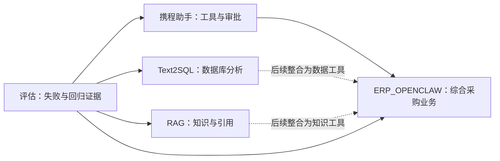

# Agent-Learning

**从工具调用、知识检索和数据库分析，逐步学到 ERP_OPENCLAW 综合业务 Agent。**

[](https://github.com/ooo1208/Agent-Learning/actions/workflows/quality.yml)

这是学习总入口，代码分别放在下面四个仓库中。三个入门工程可用 Python 3.11+ 离线运行；ERP 另有 Java、前端和服务依赖。

| 顺序 | 仓库 | 核心练习 | 章节 |
|---|---|---|---|
| 1 | [agent_ctrip_assistant](https://github.com/ooo1208/agent_ctrip_assistant) | 工具调用、预订提案、人工审批、状态恢复 | 6 章 |
| 2 | [RAG](https://github.com/ooo1208/RAG) | 文档入库、词法检索、引用、可选向量和混合检索 | 6 章 |
| 3 | [Text2SQL](https://github.com/ooo1208/Text2SQL) | 采购指标、真实 SQLite 查询、只读约束与执行预算 | 6 章 |
| 4 | [ERP_OPENCLAW](https://github.com/ooo1208/ERP_OPENCLAW) | Java ERP、MCP、DeepAgents、Skills、人工介入与异步评估 | 14 章 |
| 贯穿 | [评估学习说明](docs/evaluation.md) | 失败例、评分、回归门禁、运行追踪 | 使用 ERP 已有评估模块 |

## 项目之间的关系



求职作品可以最终收敛为 **ERP_OPENCLAW 综合采购平台 + 企业知识库 RAG**。携程项目用于建立基础；Text2SQL 可逐步接入采购分析。图中的整合箭头是后续练习，当前独立教学仓库还没有自动接入 ERP；RAG 中 OCR/GME/Milvus 等多模态内容仍是进阶计划。

## 快速开始

先安装 Python 3.11+ 和 Git。在终端执行：

```sh
git clone https://github.com/ooo1208/Agent-Learning.git
cd Agent-Learning
python learn.py clone
python learn.py demo all
python learn.py verify
```

`clone` 下载 `projects.json` 指定提交的三个独立仓库到 `repos/`，不会覆盖已有工作目录。离线演示和测试不调用模型，不需要密钥。演示使用合成数据；测试通过不表示真实模型问答效果已经验收。

想学习 ERP 时执行 `python learn.py clone --with-erp`，再按照 `repos/ERP_OPENCLAW/README.md` 安装其独立依赖。`python learn.py verify --include-erp` 仅额外运行 ERP 的合成评估门禁，并不替代完整 ERP 集成测试。

每个仓库都有中文 README、来源说明、章节文档和 `chapter-NN` 标签。切到标签前先保存自己的改动；可以另建目录学习某章：

```sh
git -C repos/RAG worktree add ../../RAG-chapter-03 chapter-03
```

章节是本次按知识依赖重新编排并提交的教学顺序，使用真实提交时间，不是官方课程原目录。各章覆盖范围以相应 README 为准。

## 学习与资料

- [学习路线与完成标准](docs/learning-path.md)
- [15 条公开教学资料及原厂参考](资料索引.md)
- [实验记录模板](实验记录模板.md)
- [ERP 模块与基础项目对应](docs/project-map.md)
- [LangGraph 官方历史 notebook](reference/LangGraph-Customer-Support/customer-support.ipynb)：附原许可证、固定提交和 SHA256；未执行其历史依赖。
- [来源与许可](SOURCES.md)
- [从 GitHub 下载后的验收记录](docs/verification.md)：40 项测试，6 项运行检查。

总入口自己的三个标签分别对应路线与资料、带许可的原始参考 notebook、可复现运行工具与 CI。它是导航仓库，不是第五个业务项目。
